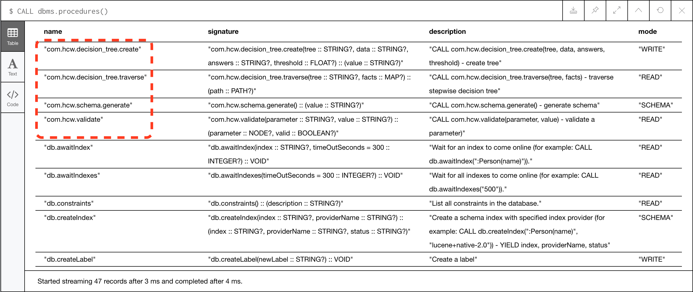
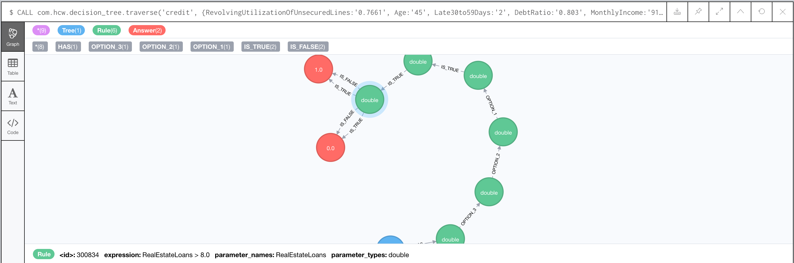

# Usage

## TODO
* Convert JSON format graph into interactive graph

## Start up
Clone the repo
```shell
git clone https://github.com/korvva/RuleEngineNeo6j.git \
&& cd RuleEngineNeo6j
```
And run
```shell!
podman compose up
```
*Notice that the image used while composing is private, please reach out for permit granting.*

Once successfully run up, neo4j is exposed to port 7474 and is accessible from [localhost:7474](http://localhost:7474). For other ports exposures please refer to settings in docker-compose.yml

*<NOTICE> For developing purpose, neo4j is set to run without database authorization. Make changes accordingly in docker-compose.yml*

```yaml!
environment:
    #-NEO4J_AUTH=none
    -NEO4J_AUTH='user/password'
```
with default user password are neo4j neo4j

## Run check
* In neo4j browser(localhost:7474), use cypher-shell command below to check if all required custom procedures are included
    
    ```cypher-shell!
    CALL dbms.procedures()
    ```
    
    The highlighted procedures above must exist.
    
* Place training data and answers in **import** folder and check if neo4j successfully load path. For instance
    
    ```Cypher
    LOAD CSV WITH HEADERS FROM "file:///answers.csv" AS row
    CREATE (a:Answer {id: toInteger(row.id), text: row.text})
    ```

## Run 
>Create Schema ----> Create Tree ----> Query Tree
* **Create Schema** simply run the following
    ```Cypher
    CALL com.hcw.schema.generate
    ```
* **Create tree** is a training process and is only needed for first run or with new data, otherwise, the trained model is stored in **data/database/graph.db**. 
    To create new tree, call custom procedure as followed
    
    ```Cypher!
    CALL com.hcw.decision_tree.create('credit', \
    '/import/training.csv', '/import/answers.csv', 0.02)
    ```
    
    where 'credit' stands for the name of tree while 0.02 is the splitting and merging threshold.
*<NOTICE> It may take quite a while for training, for up to more than 5 minutes.*
*<NOTICE> Nothing prints out in neo4j browser but only in terminal that runs up container*
    
* **Query Tree (in neo4j browser)**
    ```Cypher
    CALL com.hcw.decision_tree.traverse('TREENAME',{PAYLOAD})
    ```
    For example according to training.csv
    
    ```Cypher
    CALL com.hcw.decision_tree.traverse('credit', \
    {RevolvingUtilizationOfUnsecuredLines:'0.7661',\
    Age:'45', Late30to59Days:'2', DebtRatio:'0.803', \
    MonthlyIncome:'9120',OpenCreditLinesAndLoans:'13', \
    Late90Days:'0',RealEstateLoans:'6', \
    Late60to89Days:'0', Dependents:'2'});
    ```
    Returns graph in neo4j
    
    
* **Query Tree (through curl)**
    With `NEO4J_AUTH=none`
    ```Shell
    curl -X POST \
  http://localhost:7474/db/data/transaction/commit \
  -H "Content-Type: application/json" \
  -d "{\"statements\":[
		{\"statement\":
                \"CALL com.hcw.decision_tree.traverse('credit', \
                    {RevolvingUtilizationOfUnsecuredLines:'0.7661',\
                     Age:'45', Late30to59Days:'2', DebtRatio:'0.803', \
                     MonthlyIncome:'9120',OpenCreditLinesAndLoans:'13', \
                     Late90Days:'0',RealEstateLoans:'6', Late60to89Days:'0',\
                     Dependents:'2'});\"}]
        }"
    ```
    with `NEO4J_AUTH='neo4j/password'`
    ```shell
    curl -u neo4j:password \
    -X POST \
    http://localhost:7474/db/data/transaction/commit \
    -H "Content-Type: application/json" \
    -d "{\"statements\":[]}"
    ```
    And returns JSON format graph

